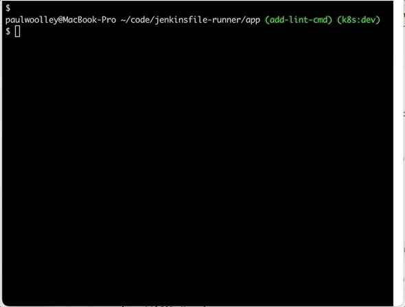

= Pipeline Verification Jenkinsfile Runner
:toc:
:toc-placement: preamble
:toclevels: 3

Jenkinsfile Runner provides a specific command usable to 
verify a pipeline without executing it (which 
run does).

== How to use it

terminal::

[source]
----
java -jar \
-Dapp.repo=./path/to/repo \
target/jenkinsfile-runner-standalone.jar lint \
-f ../goodJenkinsFile \
-w ../.jenkinsfile-runner/war/{jenkins-vers}/jenkins \
-p ../path/to/plugins
----

== When to use lint instead of run?

Users should use lint instead of run when there's no
need to run a pipeline but just the interest in checking its correctness

PROS:

* Faster time execution.
* Doesn't execute the pipeline, which might have unwanted effects or change the state of other systems.

lint command: 

run command: 

image::run-command.gif[run command example]

